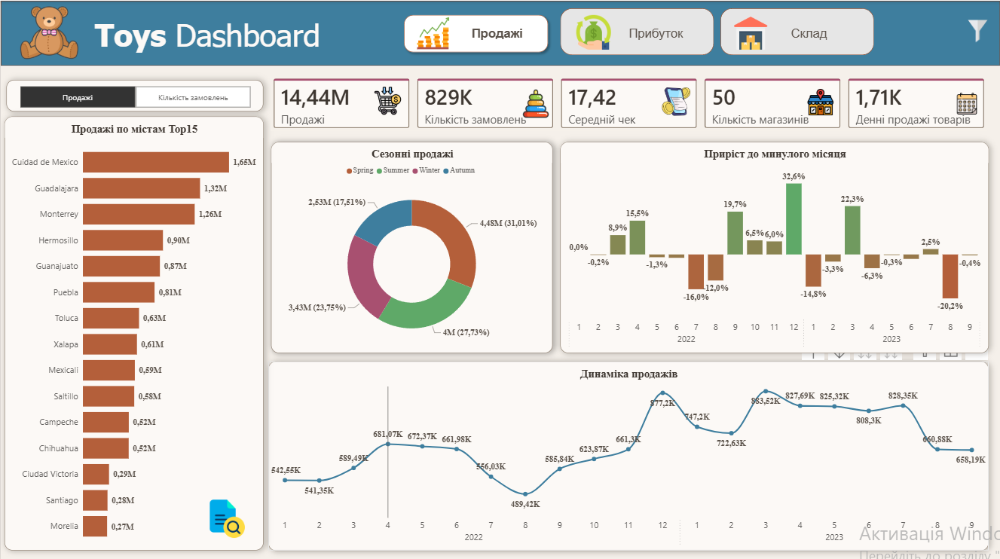

# 👋 Павло Гузь

## Junior Data / BI Analyst

Маю практичний досвід роботи з Power BI та 8-річний управлінський досвід у Domino’s Pizza Ukraine, KFC і Catering Service.

Працював з фінансовими та операційними показниками, звітністю й аналізом ефективності бізнесу.

Використовую **Power BI, SQL, Python та Excel** для аналізу даних, візуалізації та пошуку бізнес-інсайтів.

---

# 📊 Portfolio Projects

## 🧸 Retail Sales & Inventory Analysis | Power BI

Interactive Power BI dashboard for analyzing retail sales, profitability, product performance and inventory across multiple stores and cities.

**Key areas:** Sales Analysis • Profitability • Inventory • DAX • Data Modeling

### 🔗 [View Project Details](projects/power-bi-retail-sales)

---

# 🛠️ Technical Skills

**Power BI:** Power Query • DAX • Data Modeling • RLS • Drillthrough • Tooltips

**SQL:** JOIN • CTE • Subqueries • Window Functions • Aggregations

**Python:** Pandas • NumPy • Matplotlib • Seaborn • EDA

**Excel:** Pivot Tables • Power Query • INDEX/MATCH • XLOOKUP
