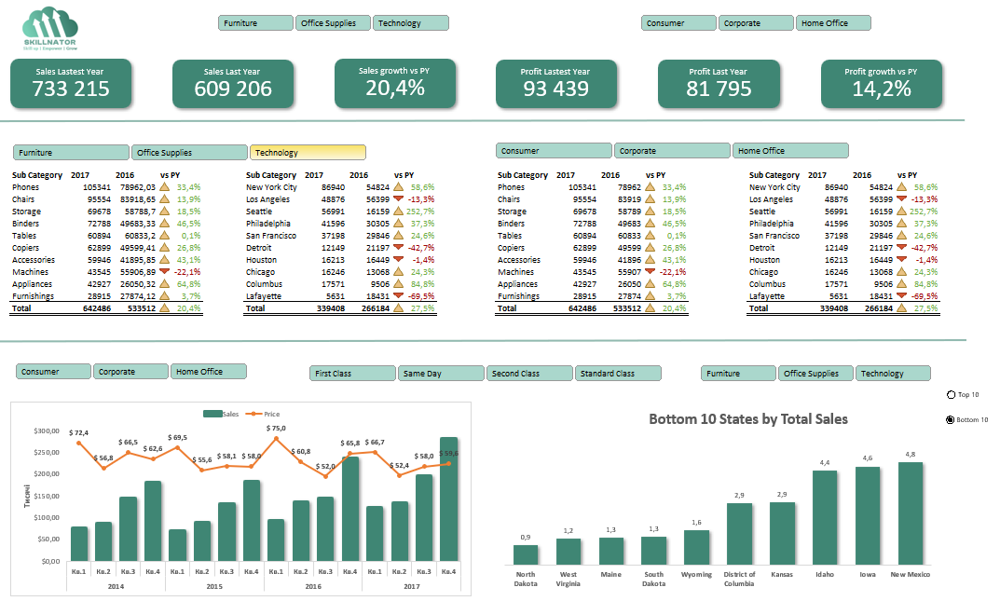
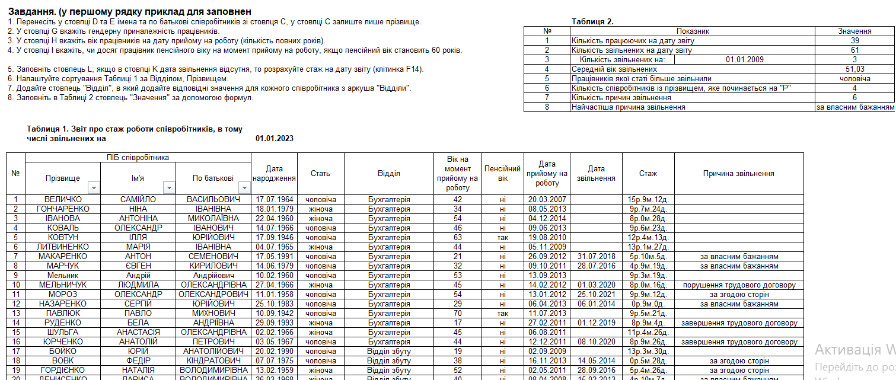

# 📊 Excel | Data Analysis & Dashboard

## 📌 Project Overview

This section contains two Excel projects demonstrating practical skills in data analysis, reporting, data visualization and working with business data.

The projects include an interactive sales dashboard and employee data analysis using Excel formulas and analytical tools.

---

## 📈 Project 1 — Sales Dashboard

Interactive Excel dashboard created to analyze sales performance and provide a clear overview of key business metrics.

### Analysis includes:

- Sales and profit KPIs
- Year-over-year growth analysis
- Sales analysis by category and customer segment
- Top 10 states by total sales
- Sales and price trends over time
- Interactive filtering using slicers
- Pivot Tables and Pivot Charts

### Dashboard

### 📁 Excel File

[Open Sales Dashboard](sales-dashboard.xlsx)

---

## 👥 Project 2 — Employee Analysis

Excel-based employee data analysis focused on transforming employee records and calculating HR-related metrics.

### Analysis includes:

- Employee age calculation
- Retirement age identification
- Employee tenure calculation
- Department lookup
- Analysis of active and terminated employees
- Termination reason analysis
- Sorting and filtering employee records
- Summary metrics calculated using formulas

### Employee Analysis

### 📁 Excel File

[Open Employee Analysis](employee-analysis.xlsx)

---

## 🛠 Tools & Skills

- Microsoft Excel
- Pivot Tables & Pivot Charts
- Slicers
- INDEX / MATCH
- VLOOKUP / XLOOKUP
- IF / IFERROR
- COUNTIF / COUNTIFS
- SUMIF / SUMIFS
- SUMPRODUCT
- Text Functions
- Date Functions
- Conditional Formatting
- Sorting and Filtering
- Data Cleaning & Transformation
- Data Visualization
- Dashboard Development
- Business Data Analysis
