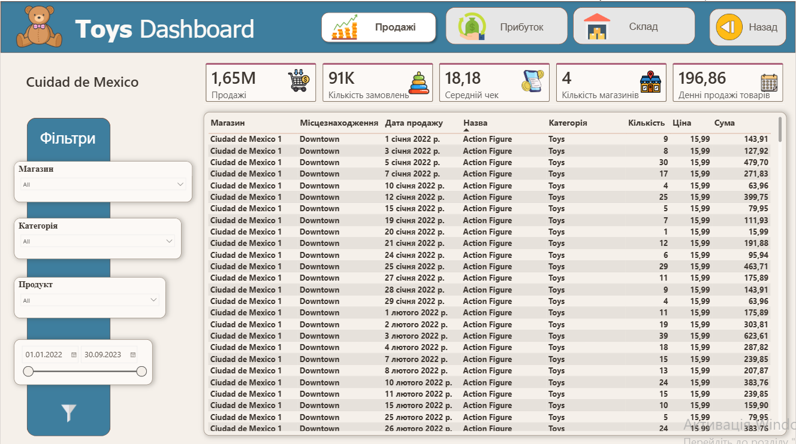
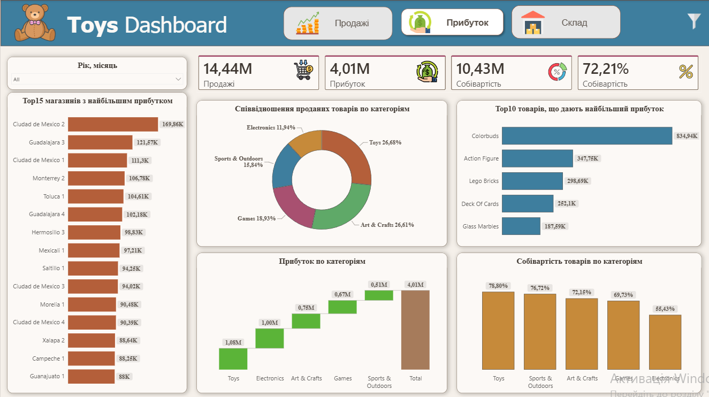
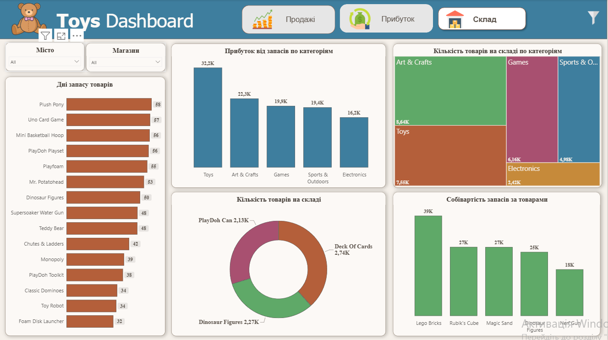

# 📊 Power BI | Retail Sales & Inventory Analysis

## 📌 Project Overview

Interactive Power BI dashboard created to analyze retail sales, profitability, product performance, and inventory levels across multiple stores and cities.

The project focuses on transforming raw retail data into clear business insights and providing an interactive tool for monitoring key performance indicators.

---

## 🎯 Business Questions

The dashboard was designed to answer the following questions:

- How do sales change over time?
- Which cities and stores generate the highest sales and profit?
- Which product categories are the most profitable?
- Which products contribute the most to overall profit?
- How does profitability vary across categories?
- What are the current inventory levels?
- Which products remain in stock for the longest periods?
- What is the value and cost of current inventory?

---

## 🛠 Tools & Skills

**Power BI**
- Power Query
- DAX
- Data Modeling
- Relationships
- Interactive Dashboards
- Drillthrough
- Slicers & Filters
- KPI Cards
- Tooltips

**Analysis**
- Sales Analysis
- Profitability Analysis
- Inventory Analysis
- Month-over-Month Growth
- Product & Category Analysis

---

## 📈 Dashboard Pages

### 1. Sales Overview

Overview of retail performance including total sales, number of orders, average order value, store count, sales trends, seasonal performance, and month-over-month growth.

---

### 2. Sales Details

Detailed drillthrough page for analyzing individual cities, stores, categories, products, and transactions using interactive filters.

---

### 3. Profit Analysis

Analysis of revenue, profit, cost, profit margin, top-performing stores, product categories, and the products generating the highest profit.

---

### 4. Inventory Analysis

Inventory dashboard showing stock levels, days of inventory, inventory distribution by category, and inventory cost.

---

## 📊 Key Metrics

- Total Sales
- Total Profit
- Cost
- Profit Margin
- Number of Orders
- Average Order Value
- Number of Stores
- Month-over-Month Growth
- Inventory Quantity
- Days of Inventory

---

## 💡 Key Insights

- Sales performance varies significantly across cities and stores.
- A limited number of stores and products contribute a substantial share of total profit.
- Product categories differ in both profitability and margin.
- Sales show noticeable seasonal and monthly fluctuations.
- Inventory analysis helps identify products with high stock levels and long inventory duration.

---

## 🚀 Project Outcome

This project demonstrates the complete Power BI analytical workflow: data transformation, data modeling, DAX calculations, KPI development, interactive visualization, drillthrough analysis, and dashboard design.

The final dashboard provides a structured view of sales, profitability, and inventory performance to support data-driven business decisions.
