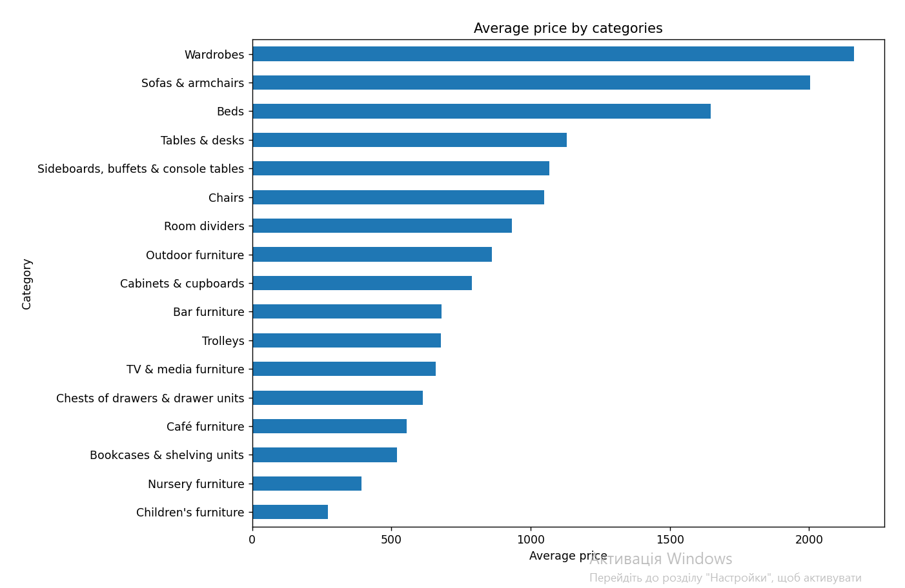
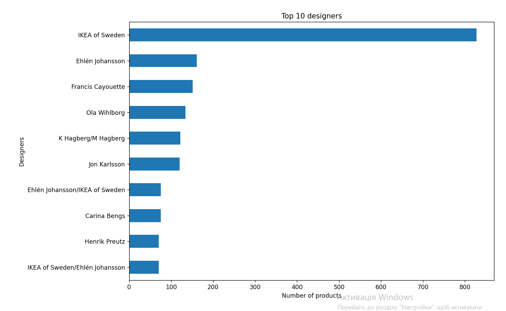
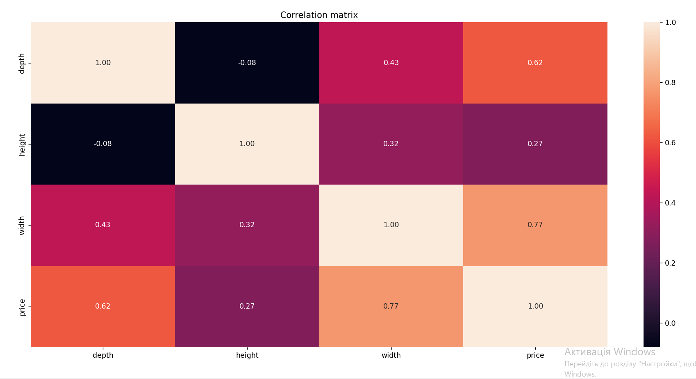

# 🐍 Python | IKEA Furniture Data Analysis

## 📌 Project Overview

Exploratory data analysis of the IKEA furniture dataset using Python.

The project focuses on data cleaning, product category analysis, price analysis, designer analysis and exploring relationships between furniture dimensions and price.

The analysis was performed using Pandas, Matplotlib and Seaborn.

---

## 🎯 Analysis Tasks

The project includes:

- Data loading and initial exploration
- Data cleaning and preprocessing
- Handling missing values and duplicates
- Product category analysis
- Price analysis
- Designer analysis
- Grouping and aggregation
- Exploratory Data Analysis (EDA)
- Correlation analysis
- Data visualization

---

## 🛠️ Python Skills Used

- Python
- Pandas
- Matplotlib
- Seaborn
- Data Cleaning
- Missing Values Handling
- Data Transformation
- GroupBy & Aggregations
- Exploratory Data Analysis (EDA)
- Correlation Analysis

---

## 💡 Key Concepts

The project demonstrates the ability to:

- Load and explore datasets using Pandas
- Clean and prepare data for analysis
- Handle missing values and duplicate records
- Group and aggregate data by product categories
- Analyze product prices and designer activity
- Explore relationships between product dimensions and price
- Perform correlation analysis
- Create visualizations using Matplotlib and Seaborn
- Summarize and interpret analytical results

---

## 📁 Project Files

- [ikea-analysis.py](ikea-analysis.py) — Python code used for data cleaning, exploratory data analysis and visualization.
- [images](images/) — Visualizations generated during the analysis.

---

## 📊 Visualizations

### Average Price by Category

### Top 10 Designers

### Correlation Matrix

